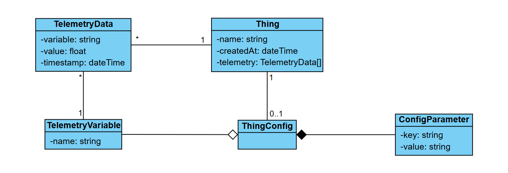

# TTiO – Sistema de Monitorización IoT

Este proyecto es mi entrega de test técnico para MTi - MINGOTHINGS

---

## 🚀 Características principales

- **Transmisión de datos en tiempo real** mediante **WebSockets**.
- Gestión de dispositivos (`Things`), su configuración (`ThingConfig`) y datos de telemetría (`TelemetryData`).
- Visualización histórica de variables (temperatura, humedad, etc.).
- Interfaz sencilla y clara desarrollada con AngularJS.
- Backend desarrollado con Node.js, Prisma y Express.

---

## 🗂 Estructura del proyecto

Cada subdirectorio contiene su propio `README.md` explicando en más detalle su propósito y cómo usarlo:

- [`frontend/README.md`](frontend/README.md)
- [`backend/README.md`](backend/README.md)

---

## 🧩 Diagrama de Clases

En una primera instancia habia desarrollado un sistema sencillo per poco extensible. En una segunda iteración he refactorizado por completo el modelo de datos. Para tener una visión global, añado el modelo conceptual de esta segunda implementación que me ha servido para organizarme.

